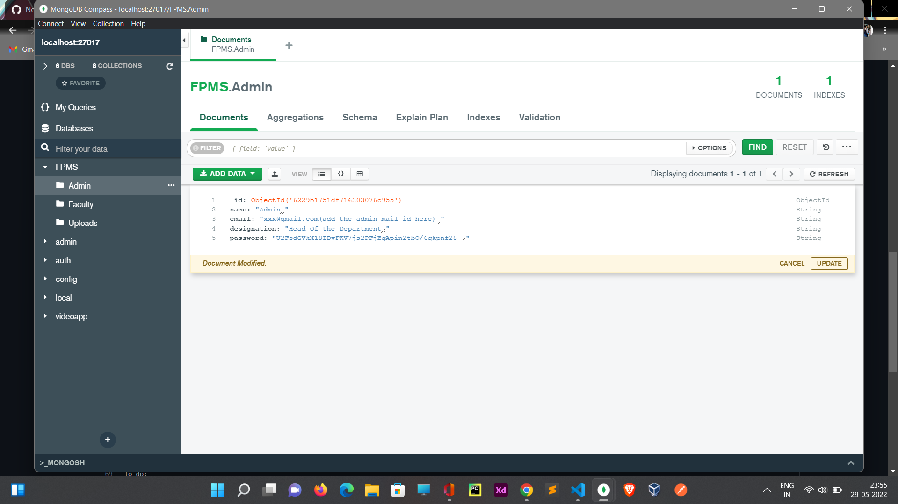

# Faculty Portfolio Management System
- A Faculty Portfolio Management System is an application which helps to manage the records of the faculties regarding the trainings undertaken, journals published, etc.
- It helps an educational institution to track the various activities and accolades received by the teachers.
- A detailed report can be generated out of the record submitted by the faculties and can be downloaded.

# Steps to run the application on local Machine
- Download and install mongodb in your system to store data
- Download and install mongodb Compass for visualizing the data present in database
- Open mongodb compass and copy and paste "mongodb://localhost:27017" in the URI text area.
- Create a databse named FPMS
- Enter the database and add collections named Admin,Faculty,Uploads in it
- The add a record in to Admin collection as shown in the below picture

